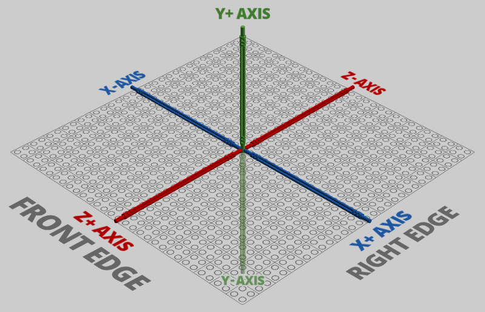

## What's new with LegoToR?
LegoToR version 0.4.8.1 delivers significant improvements with initial USD support, while also offering new features, enabled by RenderMan's USD Hydra delegate.

## What is USD?
USD is a technology developed at Pixar Animation Studios to address the challenges of feature film production. In professional environments using multiple applications (such as Maya or Katana), USD can enable an efficient and flexible collaboration, including sharing of animated geometry, materials, and lights. USD also serves as an interchange format for augmentation 3D data used by Apple in their augmented reality systems. USD support is planned or released from vendors like Autodesk and Nvidia. This new technology will play an increasingly important role across the industry.

# Product Questions

## Where can I find the latest versions of Lego Digital Designer?
The Windows version is still available [here](https://www.lego.com/assets/franchisesites/ldd/installer/setupldd-pc-4_3_12.exe) (MD5 Checksum: 1234).
The macOS version version is still available [here](https://www.lego.com/assets/franchisesites/ldd/installer/SetupLDD-MAC-4_3_11.zip) (SHA1 checksum: CAB24D575BA4A62672C2E7A7CE45C8A55CD3BF3A).
A mirror on google drive is also available here

## LegoToR doesn't work ...?
Create an issue in the github repository with OS information, LDD version and at best also add the LXF file and system output.

# The Future Of LegoToR

## Will rendering make use of GPU hardware?
Pixar has been developing various special purpose GPU renderers internally and there is an experimental RenderMan XPU project to combine CPU+GPU computations for faster rendering. So far there is no external release date announced by Pixar yet. Once it is available LegoToR plans to support is as well. In addition you are encouraged to use USD and the various Hydra render delegates which offer GPU support.

## Will there be support for other applications or formats like MLCAD, LDraw or Stud.io?
I track other applications and formats. An important aspect of LegoToR version 0.4.8.1 has been specifically to support USD. I understand the power and capabilities of applications and formats such as MLCAD, LDraw or Stud.io, and the strong interest in them. As LegoToR is completely open-source I encourage a fork or pull requests to make that happen.

# OS Specifics

## Is Linux supported by LegoToR?
Yes. LegoToR uses Python since the beginning specifically with Linux users in mind and should work on Linux, as does RenderMan. While no Linux version of Lego’s LDD is available you can use the LDD library on Linux to render your files. Just grab the Windows version of LDD and extract it. It contains LDD's library. 

## What is the biggest model size LegoToR supports?
Limitation is more on LDD itself to create models and on your computer to render. LDD supports approximately 100k parts, but numbers depend on complexity of the parts themselves. As LDD is still a 32bit application it can not handle more then ~2GB of RAM (2GB/2GB Application/Kernel). Having said that, LegoToR has no problem in converting for example the [UCS Millennium Falcon™ 75192](https://www.lego.com/en-us/product/millennium-falcon-75192) in approximately 40 seconds on my machine.

# Technical

## Where can I learn more about LDD’s file format?
A good starting read is at Eurobricks [here](https://www.eurobricks.com/forum/index.php?/forums/topic/92863-understanding-ldds-lxfml-schema/).

## What coordinate system does LDD use?
LDD uses a right handed coordinate system. RenderMan is a left handed [coordinate system](https://renderman.pixar.com/resources/RenderMan_20/insideOutside.html). USD is right handed. Transformations in LDD are standard 3D transformation matrices. Just 4 rows, 3 numbers each and an added 4th column containing just 0, 0, 0, 1.

LDD coordinate system:

